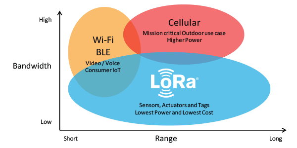

# [Pi RF](https://github.com/OS-Q/D159)

#### 关于系统架构：[OS-Q](https://github.com/OS-Q)
#### 归属边缘体系：[EDGE-Q](https://github.com/EDGE-Q)

### [设备描述](https://github.com/OS-Q/D159/wiki)

[Pi RF](https://github.com/OS-Q/D159)用于支持Pi的无线通信扩展

### [收录资源](https://github.com/OS-Q/D159)

- [资源](src/)
- [文档](docs/)

### [OS-Q = Open Solutions | Open Source |  Operating System ](http://www.OS-Q.com/D159)
####  2019-9-8
